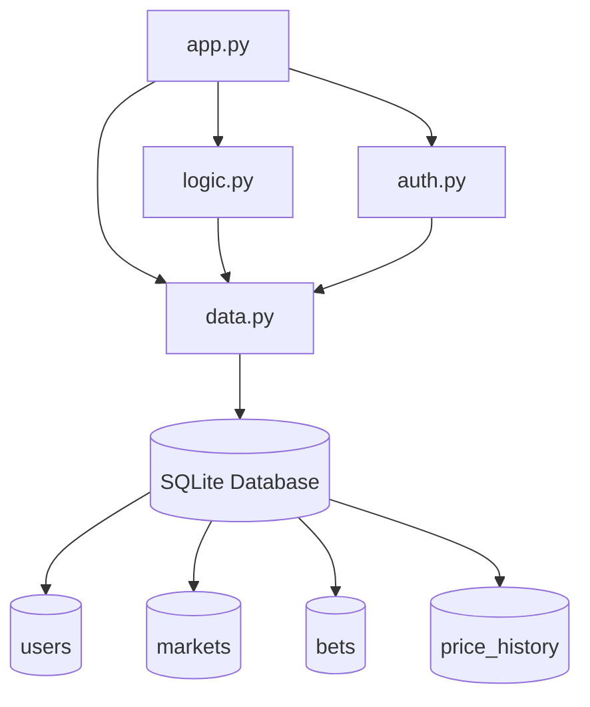
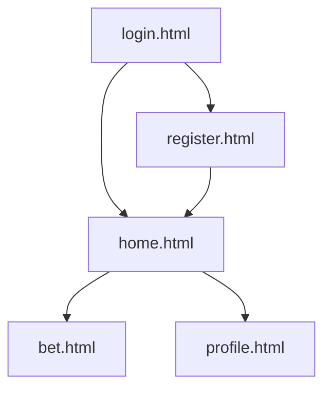

# System Blueprint (_a.k.a._ "Design Doc")

## TNPG: Fibichupi
## project: name
## Target ship date: {2026-06-01}

---

#### roster: Wesley Leon (PM), Kyle Liu, Jake Liu, Mottaqi

| Name | Email | Primary Role | Secondary Role |
|---|---|---|---|
|Wesley Leon|wesleyl30@nycstudents.net|Backend|Project Management|
|Kyle Liu|kylel114@nycstudents.net|Frontend|UI/UX|
|Jake Liu|jakel110@nycstudents.net|Database Handling|Backend|
|Mottaqi|mottaqia2789@nycstudents.net|Frontend|CSS|

---

# Summary
We are making a polymarket clone, using github commits as currency. Users will be able to create bets that they will release decisions on, and also bet on bets.

## Problem Being Solved
This app is for people who want to bet on anything going on in the world using a fake currency.

## Target Users

Who will use this system?

- users who want to practice betting on prediction markets
- users who want to have fun

## Why This Project Matters
An risk-free alternative to other prediction markets.

---

# Minimum Viable Product (MVP) Scope

## Core Features (Required for Final Submission)
Features that **must** be completed:
1. betting
2. price graph

## Stretch Features (Only if MVP is Complete)
1. leaderboard

## Explicit Non-Goals

Features intentionally excluded:
- Real money betting

---

# Technology Stack

| Layer | Selected Tool |
|---|---|
| Backend Framework | Flask |
| Frontend Framework | tailwind |
| Database | SQLite |
| Authentication | Flask sessions |
| ORM / DB Library | none |

## Why This Stack Was Chosen
We are using Flask because it is what we are most familiar with. We chose to use Tailwind because it does not use a default theme like Bootstrap or Foundation, allowing our team greater control over our styling. We want to use a database structure that is easy to use and perform efficient data retrieval and management, so we decided on SQLite's relational database.

---

# Team Ownership Plan

Each member must own meaningful deliverables.
| Team Member | Primary Ownership    | Secondary Ownership  | Specific Deliverables                            |
| ----------- | -------------------- | -------------------- | ------------------------------------------------ |
| Wesley Leon | Backend Logic        | Project Coordination | Betting engine, session handling |
| Kyle Liu    | Frontend Development | UI/UX                | Homepage, market pages,|
| Jake Liu    | Database Design      | Backend Support      | SQLite, Flask routes, market data storage|
| Mottaqi     | Styling              | Frontend Support     | Tailwind styling, graphs integration|

---

# Component map

# Site map

## Key User Stories
### eg0
As a new user, I want to register with my GitHub account so that my commit history can be verified and used as currency.

### eg1
As a registered user, I want to browse open markets so that I can test my predictions without risking real money.

### eg2
As a market creator, I want to create a yes/no question and later resolve it so that bettors are paid out correctly.

# Database Design

Users:

| Column        | Type    | Description           |
| ------------- | ------- | --------------------- |
| id            | INTEGER | Primary key           |
| username      | TEXT    | Unique username       |
| password_hash | TEXT    | Hashed password       |
| balance       | INTEGER | User currency balance |
| total_commits | INTEGER | Total github commits  |

Markets:

| Column      | Type    | Description             |
| ----------- | ------- | ----------------------- |
| id          | INTEGER | Primary key             |
| title       | TEXT    | Market question         |
| description | TEXT    | Additional details      |
| creator_id  | INTEGER | User who created market |
| status      | TEXT    | open/resolved           |
| result      | TEXT    | yes/no result           |

Bets:

| Column    | Type    | Description         |
| --------- | ------- | ------------------- |
| id        | INTEGER | Primary key         |
| user_id   | INTEGER | User placing bet    |
| market_id | INTEGER | Market being bet on |
| side      | TEXT    | yes/no              |
| amount    | INTEGER | Bet amount          |
| timestamp | DATETIME| Time of bet         |

Price History:

| Column    | Type     | Description    |
| --------- | -------- | -------------- |
| id        | INTEGER  | Primary key    |
| market_id | INTEGER  | Related market |
| timestamp | DATETIME | Time of update |
| price     | REAL     | Market price   |

# Testing Plan

## Authentication & Registration

| Test | How to test | Pass condition |
|---|---|---|
| User can register with username + password | Submit register form with valid inputs | Redirected to home, user row exists in DB |
| Duplicate username is rejected | Register twice with same username | Error message shown, no duplicate row |
| Login with correct credentials succeeds | Submit login form with valid user | Session cookie set, redirected to home |
| Login with wrong password fails | Submit login form with bad password | Error shown, no session created |
| Unauthenticated users can't access protected pages | Navigate to /profile or /bet without session | Redirected to login |

## Market Creation & Resolution

| Test | How to test | Pass condition |
|---|---|---|
| Logged-in user can create a market | Submit create market form with title + description | Market appears in DB with status = open, creator_id set correctly |
| Market appears on browse page | Navigate to home after creating market | New market visible in list |
| Creator can resolve market as yes or no | Creator clicks resolve, selects outcome | Market status = resolved, result column set |
| Non-creator cannot resolve market | Log in as different user, attempt to resolve | Option not shown, or 403 returned if attempted via URL |

## Betting Logic & Payouts

| Test | How to test | Pass condition |
|---|---|---|
| User can place a yes or no bet | Open a market, submit a bet with an amount | Bet row added to DB, user balance decremented |
| User cannot bet more than their balance | Submit bet amount exceeding current balance | Error shown, balance unchanged |
| Winners are paid out after resolution | Resolve market, check winning users' balances | Winners' balances increase by correct amount |
| Losers receive nothing after resolution | Check losing users' balances after resolution | Balance unchanged from before resolution |
| Bets on a resolved market are rejected | Attempt to bet on a resolved market | Error returned, no bet row added |

## Data Integrity

| Test | How to test | Pass condition |
|---|---|---|
| Price history updates when a bet is placed | Place a bet, query price_history table | New row with correct market_id, timestamp, price |
| Deleting a user doesn't corrupt market data | Remove a user who created a market | Market and bets still exist, no orphaned FK errors |

## Frontend / Price Graph

| Test | How to test | Pass condition |
|---|---|---|
| Price graph renders on bet page | Navigate to a market with at least one bet | Graph visible with at least one data point |
| Graph updates after a new bet is placed | Place a bet, reload bet page | New data point appears on graph |
| Profile page shows correct balance and bet history | Place bets, visit profile page | Balance and past bets listed accurately |

# Timeline
## Week 1 Goals: login and register setup, homepage set up with questions
## Week 2 Goals: users able to bet on questions
## Week 3 Goals: clean up design of app
## Internal Deadlines:
{List milestones your team has identified, in the order they must be completed. Set a target completion date for each.}

# Completion Criteria (_a.k.a._ "Definition of 'Done'")
Project is considered complete when all of the following are true:
1. users can bet on Questions
2. users are rewarded accordingly to the result of the question
3. signup is linked to github to prevent market manipulation 

# Open Questions
Should we make realtime price updating
